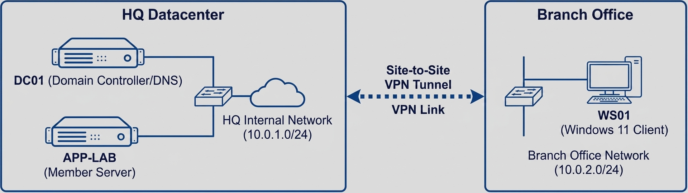

# Building a Multi-Site Identity Infrastructure

Most "home labs" stop at installing a Domain Controller. I wanted to simulate a real corporate environment with branch offices, security hardening, and automated lifecycle management.

This project was built using **Windows Server 2022** and **PowerShell**, combining concepts from TCM Security and CBT Nuggets.

## 1. The Architecture

The environment consists of a primary datacenter (HQ) and a simulated remote branch office.

- **DC01 (Headquarters):** The Primary Domain Controller hosting the schema master and DNS.
- **APP-LAB (Member Server):** A dedicated application server for hosting IIS and testing service accounts.
- **WS01 (Client):** A Windows 11 Enterprise workstation for testing Group Policy application.



## 2. Infrastructure "Plumbing"

Before creating users, I had to ensure the underlying plumbing was solid.

- **DNS Loopback:** I configured `DC01` to use `127.0.0.1` for DNS. This forces the DC to query its own local records first, ensuring it finds the `LAB.local` zone instead of forwarding queries out to the internet immediately.
- **Reverse Lookup Zones:** I manually created a Reverse Lookup Zone. While AD works without it, troubleshooting tools like `ping -a` (resolving IP to Hostname) fail without it.

## 3. Security Hardening

### The "gMSA" Challenge

I replaced standard service accounts with **Group Managed Service Accounts (gMSA)**. In a traditional setup, service accounts have static passwords that rarely get changed, creating a security risk. gMSAs rotate their own 120-character complex passwords every 30 days.

**The "10-Hour" Roadblock:**
AD enforces a 10-hour wait time after creating the KDS Root Key to ensure replication across a forest. Since this was a lab, I bypassed this using a backdated timestamp:

```powershell
Add-KdsRootKey -EffectiveTime (Get-Date).AddHours((-10))
```

### PKI & Certificates

I implemented a **Two-Tier PKI** hierarchy:

1. **Offline Root CA:** The "Master Key" that stays offline for security.
2. **Subordinate CA:** The online server issuing certificates to computers.
3. **HTTP CRL:** I configured an IIS web server to host the _Certificate Revocation List_, ensuring clients could verify if a certificate was still valid via HTTP.

This lab proved that **Identity** is more than just usernames and passwords—it's about the availability, security, and automation of the entire authentication chain.
